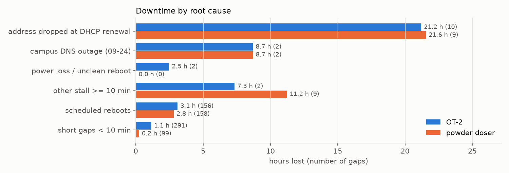
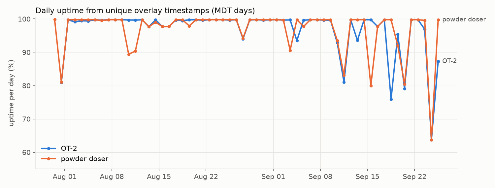
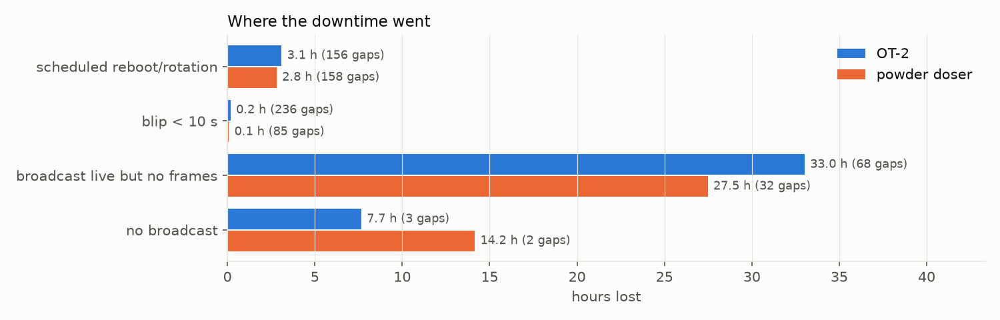
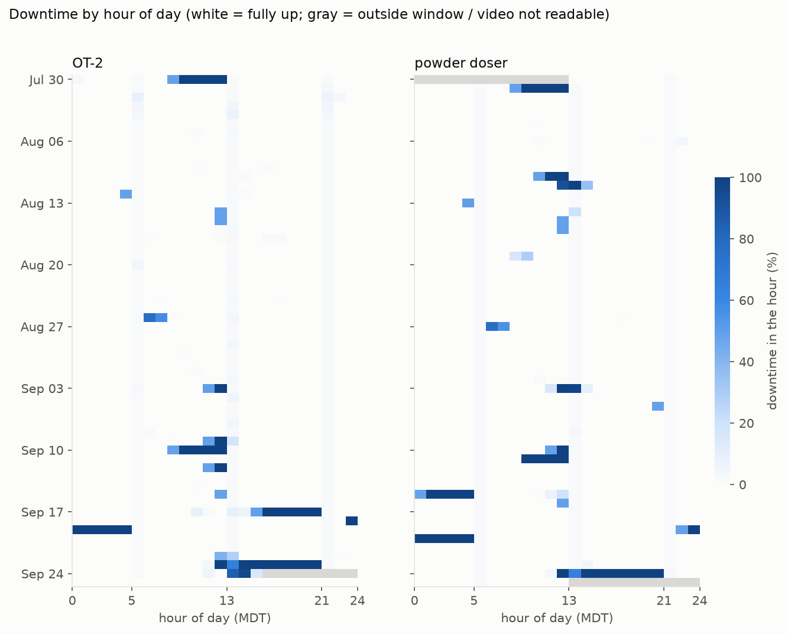
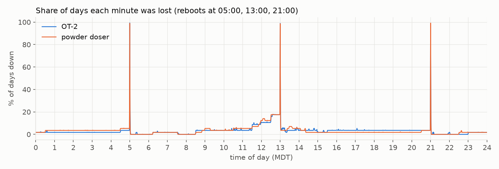

# Stream uptime from the timestamp overlay (issue #9)

**uptime = unique overlay timestamps ÷ seconds in the window.** The window runs from a device's first broadcast
start to the end of its last completed broadcast. Every archived OT-2 and powder-doser broadcast was
downloaded at 144p, and the `%Y-%m-%d_%H-%M-%S` overlay was read on every decoded frame.

| device | window (MDT) | unique seconds | uptime | downtime |
|---|---|---|---|---|
| OT-2 | 2026-07-31 00:02 → 09-25 15:20 (56.6 d) | 4,735,249 | **96.77 %** | 44.0 h |
| powder doser | 2026-07-30 13:22 → 09-25 13:00 (57.0 d) | 4,763,206 | **96.74 %** | 44.5 h |

Uptime by period: OT-2 98.7 % (Jul 30 – Aug 31), 94.2 % (Sep 1–25), 91.5 % (Sep 10–25);
powder doser 98.1 %, 94.9 %, 92.8 %.

## Where the downtime went

| cause | OT-2 | powder doser |
|---|---|---|
| broadcast live but no frames (stream froze or died mid-block) | 33.0 h (68 gaps) | 27.5 h (32) |
| no broadcast at all | 7.7 h (3) | 14.2 h (2) |
| scheduled reboot / new broadcast at 05:00, 13:00, 21:00 | 3.1 h (156 × ~70 s) | 2.8 h (158 × ~65 s) |
| blips < 10 s | 0.2 h (236) | 0.1 h (85) |

- 31 h of the downtime is the *same seconds* on both cameras (OT-2 42 h, powder doser 44.5 h over the
  overlapping window), so most of it has a cause the two Pis share: the network, YouTube, or power.
- 33 stalls lasted ≥10 min while the broadcast stayed live. **19 of them start at hh:30:44–50**, and 22 end
  exactly at the next scheduled reboot. The powder-doser Pi renews its DHCP lease at hh:00:44 and hh:30:44
  after each reboot (see its journal). So the stream dies around a lease renewal (or some other event on
  the same 30-min cadence), and nothing brings it back until the next reboot.
- The two "no broadcast" outages are 09-24 13:22–21:01 (both cameras; the DNS outage described in
  byu-vcl#202) and 09-19 22:30–09-20 05:01 (powder doser; it also starts at hh:30:44).

## Root cause

The Pi journals explain the hh:30:44 stalls. A bogus ARP packet from `00:00:00:00:00:00` claims the
Pi's own address. NetworkManager's address conflict detection then drops the address at a DHCP renewal,
so the Pi is offline for about 53 min. `device.py` fails to start 3 times and systemd gives up, so the
stream stays down until the next reboot. The full sequence, and the fixes (ACD off, and a watchdog that
restarts a failed unit), are in [`../pi/README.md`](../pi/README.md). `root_cause.py` assigns every gap
to a cause:

| cause | OT-2 | powder doser |
|---|---|---|
| address dropped at DHCP renewal | 21.2 h (10) | 21.6 h (9) |
| campus DNS outage (09-24) | 8.7 h (2) | 8.7 h (2) |
| power loss / unclean reboot | 2.5 h (2) | 0.0 h (0) |
| other stall >= 10 min | 7.3 h (2) | 11.2 h (9) |
| scheduled reboots | 3.1 h (156) | 2.8 h (158) |
| short gaps < 10 min | 1.1 h (291) | 0.2 h (99) |
| uptime | 96.77% | 96.74% |
| uptime without renewal drops | 98.33% | 98.32% |

## Plots

## Method and checks

- `fetch_broadcasts.py`: lists broadcasts through the YouTube API (532 on the channel).
- `download.py`: runs yt-dlp at 144p. YouTube bot-blocks the CI runner and ties media URLs to the
  requesting IP, so everything goes through SOCKS tunnels to an idle campus Pi over Tailscale.
- `overlay.py` / `train_templates.py`: the time digits are cut from fixed cells and matched against
  per-position mean templates. The templates come from tesseract labels (OT-2's 144p digits are ~5 px, so
  the labels came from the aligned 360p rendition), then from a time-of-day self-training pass for the
  hour digits. Held-out accuracy was 250/250 (OT-2) and 252/252 (powder doser).
- `process.py`: decodes with `-skip_frame noref` (every I/P frame, ~5 per video second; 49 M frames in
  total). It keeps the max-weight increasing subsequence of labels, which drops misreads: only 3 label
  runs were dropped across all videos, and no frame was unreadable. On two test videos a full every-frame
  decode found 0 and 3 more seconds (of ~28,700). "Ambiguous" jumps, where B-frames could have held an
  extra label, number 285 + 100 in total. That is at most ~0.01 % of uptime.
- `analyze.py`: builds `summary.json`, `gaps.csv` (every gap, with its cause), `videos.csv` and `plots/`.
- `root_cause.py`: reads `gaps.csv` and assigns each gap to a root cause (`root_cause.json`, `plots/root_cause.png`).

## Not covered

- **aurora-\*** (6 cameras, Jul 28 – Aug 12): no timestamp overlay, and broadcasts over 12 h were never
  archived by YouTube. Broadcast-time coverage from the API alone is 97–100 % (`summary.json`).
- **office cam** (93 broadcasts) and **pose-2026**: private videos, so they can't be downloaded without
  a signed-in session. API broadcast coverage: office cam 99.9 %.
